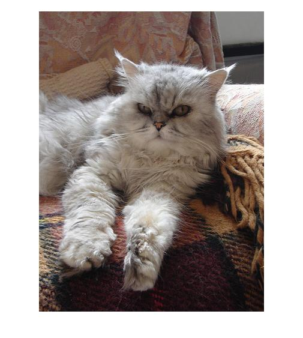
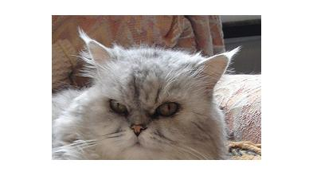

# machine_learning
A Matlab app that uses support vector machines to classify whether a picture has a cat or dog face in it

#Datasets

For training the classifier am using the Cat Annotation Dataset from 

Weiwei Zhang, Jian Sun, and Xiaoou Tang, "Cat Head Detection - How to Effectively Exploit Shape and Texture Features", Proc. of European Conf. Computer Vision, vol. 4, pp.802-816, 2008.

and the Stanford Dogs Dataset from 

http://vision.stanford.edu/aditya86/ImageNetDogs/

#Todos

- With problem of telling between cat or dog, will need to precrop faces for best results. Could have 3rd value of neither, and search picture (by breaking up into windows) for either cat or dog faces. Or just dog or not face, etc.

#Cat Annotation Dataset

###Structure

    |-- cat_dataset
        |-- CAT_00
            |-- 00000001_000.jpg
            |-- 00000001_000.jpg.cat
            |-- 00000001_005.jpg
            |-- 00000001_005.jpg.cat
            ...
        |-- CAT_01
        |-- CAT_02
        |-- CAT_03
        |-- CAT_04
        |-- CAT_05
        |-- CAT_06

Provided is a listing.json file 

    ["CAT_00/00000001_000",
     "CAT_00/00000001_005",
     "CAT_00/00000001_008",
     "CAT_00/00000001_011",
     "CAT_00/00000001_012",
     "CAT_00/00000001_016",
     "CAT_00/00000001_017",
     ...

A .cat file contains 19 numbers

    9 175 160 239 162 199 199 149 121 137 78 166 93 281 101 312 96 296 133 

The first is always 9, and the next pairs[x to right, y down] are 

- Left Eye
- Right Eye
- Mouth
- Left Ear-1
- Left Ear-2
- Left Ear-3
- Right Ear-1
- Right Ear-2
- Right Ear-3

Here is the cat for those coordinates

Here is the cat with yellow squares where the coordinates exists

Here is the image cropped to only include the coordinates

Here is a larger cropping image with a filter to increase the height and weight by 50% respectively.

#Stanford Dogs Dataset

###Structure

    |-- dog_dataset
        |-- Annotation
            |-- n02085620-Chihuahua
                |-- n02085620_7
                |-- n02085620_199
                |-- n02085620_242
                |-- n02085620_275
                ...
            |-- n02085782-Japanese_spaniel
            |-- n02085936-Maltese_dog
            |-- n02086079-Pekinese
            ... 
        |-- Images
            |-- n02085620-Chihuahua
                |-- n02085620_7.jpg
                |-- n02085620_199.jpg
                |-- n02085620_242.jpg
                |-- n02085620_275.jpg
            |-- n02085782-Japanese_spaniel
            |-- n02085936-Maltese_dog
            |-- n02086079-Pekinese
            ... 

An annotation file contains xml data including xmin/xmax/ymin/ymax values for the dog in the image

    <annotation>
        <folder>02085620</folder>
        <filename>n02085620_7</filename>
        <source>
            <database>ImageNet database</database>
        </source>
        <size>
            <width>250</width>
            <height>188</height>
            <depth>3</depth>
        </size>
        <segment>0</segment>
        <object>
            <name>Chihuahua</name>
            <pose>Unspecified</pose>
            <truncated>0</truncated>
            <difficult>0</difficult>
            <bndbox>
                <xmin>71</xmin>
                <ymin>1</ymin>
                <xmax>192</xmax>
                <ymax>180</ymax>
            </bndbox>
        </object>
    </annotation>

Here is the dog for those coordinates

